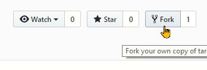
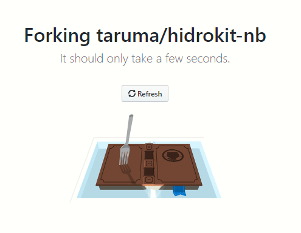
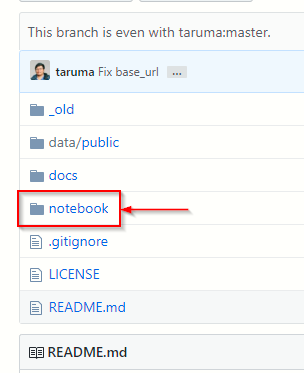
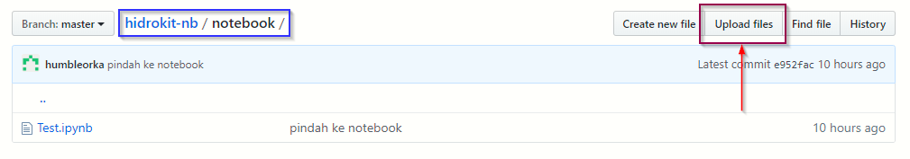
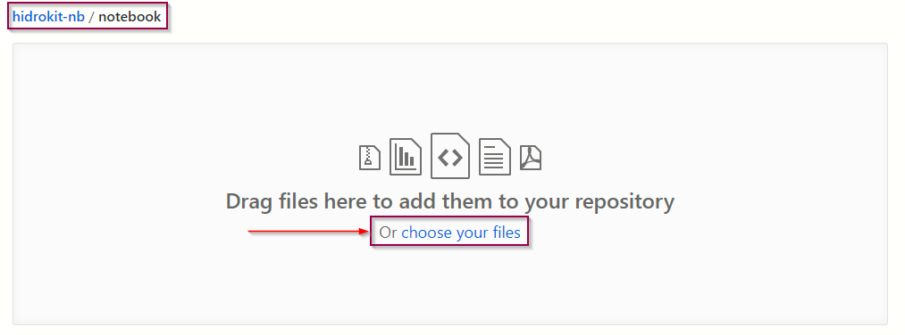
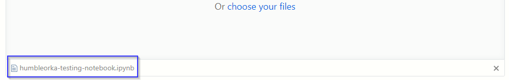
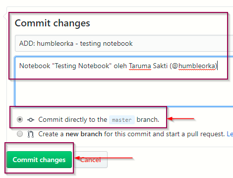
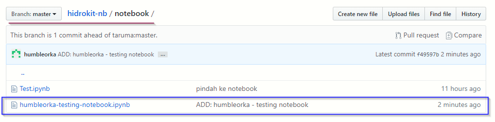

Halaman ini merupakan panduan dalam mengunggah notebook ke repo hidrokit-nb. Tidak diperlukan pengetahuan Git/Github untuk mengunggah notebook melalui GitHub.

# Daftar Isi
{: .no_toc .text-delta }

1. TOC
{:toc}

---
## Persiapan

1. Notebook yang dimaksud adalah _file_ berekstensi `.ipynb`.
1. Menamai _file_ dengan format `pemilik-judul.ipynb` atau `pemilik-judul-v0.ipynb` jika memiliki nomor versi (isi spasi dengan `-`). Gunakan nama _username_ GitHub untuk konsistensi.
1. Pastikan notebook sudah tertera lisensinya (baca: [Lisensi Notebook](/panduan/lisensi-notebook)).
1. Memiliki akun GitHub (jika belum, [daftar disini](https://github.com/join)).
1. Dilakukan melalui komputer (_desktop_).

---
## Unggah Notebook ke hidrokit-nb

Jika ini bukan pengalaman pertama dalam mengunggah notebook. Baca [Unggah dokumen lagi](#unggah-lagi).

### *Fork hidrokit-nb*
- Masuk akun [GitHub](https://github.com/login).
- Buka tautan [https://github.com/taruma/hidrokit-nb/](https://github.com/taruma/hidrokit-nb/).
- Klik ___Fork___ pada tepi kanan atas.

     

- Akan muncul proses _forking_.

     

- Tunggu proses _fork_ selesai.

### _Upload Files_
- Setelah proses _fork_ selesai. Klik `notebook` pada daftar _folder_.

     

- Klik __Upload files__. Pastikan bahwa Anda berada di direktori `hidrokit-nb/notebook/`.

     

- Akan terbuka halaman untuk mengunggah _file_. Anda bisa mengupload dengan cara ___drag files___ atau mengklik pilihan __choose your files__. Pastikan berada di direktori `hidrokit-nb/notebook`.

     

- Pastikan bahwa notebook anda terunggah.

     

- Isi deskripsi _commit_ seperti pada gambar. Pastikan pilihan sudah seperti di gambar. Klik **Commit Changes**. 

     

- Hasil unggah dapat dilihat dengan membuka direktori `notebook`.

     

### _Pull Request_

Jika notebook yang ingin diunggah sudah tersimpan pada _repo_ Anda. Saatnya menggabungkan hasil unggahan/perubahan yang Anda lakukan dengan _repo_ hidrokit-nb. 

- Buka halaman [GitHub hidrokit-nb](#)

---
## Unggah lagi
{: .no_toc}

--
## Bacaan lebih lanjut
- [Forking Project](https://guides.github.com/activities/forking/)