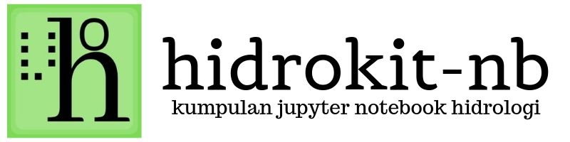
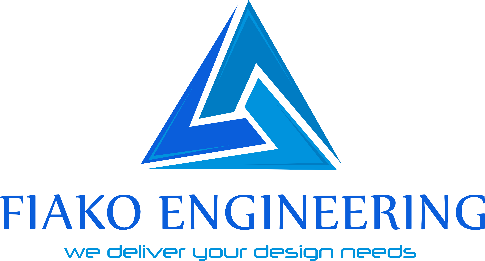

    

Kumpulan _jupyter notebook_ mengenai penggunaan [hidrokit] dan python dalam bidang hidrologi. 
{: .fs-5 .fw-400 }

[Lihat Kumpulan _Notebook_](kumpulan-notebook){: .btn .btn-primary .fs-5 .mb-4 .mb-md-0 .mr-2 }
<!-- [Unggah _Notebook_](panduan/mengunggah-notebook){: .btn .btn-outline .fs-5 .mb-4 .mb-md-0 } -->

---

SITE/REPOSITORY STATUS
{: .label .label-red .fs-2 .fw-300 .text-delta}

---

THANKS TO
{: .label .label-green .fs-2 .fw-300 .text-delta}

---

SPONSOR
{: .label .label-green .fs-2 .fw-300 .text-delta}

    

---
Proyek [hidrokit] dan [hidrokit-nb] dikelola oleh [@taruma]
{: .no_toc .text-delta .fs-2}

<!-- LINK -->
[hidrokit]: https://github.com/hidrokit/hidrokit
[hidrokit-nb]: https://github.com/hidrokit/notebook
[@taruma]: https://github.com/taruma